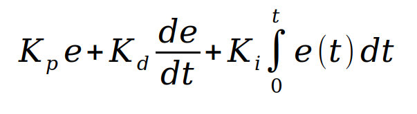
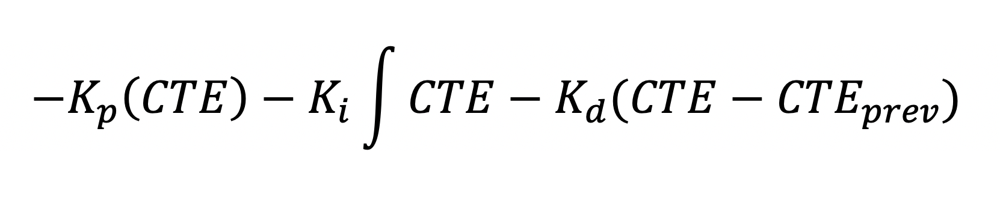
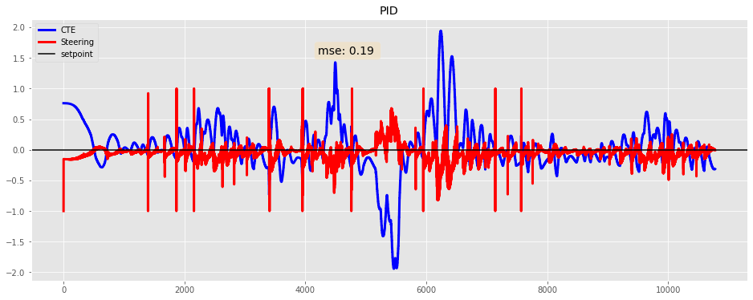

# CarND-Controls-PID
[](http://www.udacity.com/drive)

[](https://youtu.be/E_DrSCbe_X4)

## Writeup

The objective of the project is to implement a PID controller that can drive the car in the simulator safely through the websocket communication
where the simulator will feed the program a JSON formatted data of CTE, Speed, Steering Angle and few others and it expect the program to reply
with new steering angle to cruise the car safely by minimizing the Cross Track Error (CTE).

PID is the acronym for **proportional–integral–derivative controller** which is according to [Wikipedia](https://en.wikipedia.org/wiki/PID_controller) definition is:

```
A proportional–integral–derivative controller (PID controller or three-term controller) is a control loop mechanism employing feedback that is widely used in industrial control systems and a variety of other applications requiring continuously modulated control. A PID controller continuously calculates an error value e(t) as the difference between a desired setpoint (SP) and a measured process variable (PV) and applies a correction based on proportional, integral, and derivative terms (denoted P, I, and D respectively)
```

Mathematically PID can be express as follows:



Image source: [Hackernoon](https://hackernoon.com/a-conceptual-breakdown-of-pid-controllers-9fa072a140a5)

However for this project we will be using slightly tweaked PID equation that exclude time from the equation as such:



#### Proportional (P)

"Proportional" or "P" for short, is the component that has the direct effect on the car's behavior. It causes the car to steer proportionally to the CTE (Cross Track Error), that is the car's center distance from the lane center. If the car is widely far to the left, it will adjust for the steering angle correction to go right. If its the opposite, the steering angle update will make it go left and try and keep the car as close to the center as possible.

The P or Proportional component of the PID is the main component to steer the car by applying the force propositional to the CTE in opposite direction when the CTE is greater than 0. As example as shown in the image below when the gain of the P is set to 1 the steer produced the exact magnitude but in the opposite direction which move the car back to the position of the center. The P can steer the car without issue on the straight lane however unable to steer correctly on turn.


#### Integral (I)

The integral component is the accumulation of the Cross Track Error (CTE) overtime and it's used mainly to eliminate systemic error such when the mechanical part of a vehicle is poorly calibrated. However due to the nature of the accumulation, for the car in this project simulation it should be tuned to a very small value as we can see from the following chart, the value of 1 with other gain parameters are set to 0, causes too much drag that causes delay to steer to opposite direction of CTE.


#### Differentiation (D)

This component serve as the rate of change of the CTE, in other word subtracting the currenct and previous CTE. As demonstrated in the chart below, the D component alone cannot steer the car to reduce the CTE as the force it applies will be very litte if the CTE is not oscilatting.


The D component should be combined with P as display in the chart below the Mean Square Error (MSE) significantly reduced to only 0.07 from the 6.24 when the gain in P is configured to 1 and D to 10.


The final hyperparameter for the gain in the P,I and D were chosen using both manual and twiddle. The twiddle algorithm is implemented as described from the lesson as follow but with slight modification to allow the interation with the simulator.


The program can be executed with `-t` parameter to enable twiddle. The following command is example to run twiddle with initial PID as zero and starting potential difference of 0.1, 0.0001  and 1 for the P,I and D respectively. The `-p`, `-i`, `d`, `--dp`, `--di` and `--dd` allow to continue the twiddle from last execution.

```
build/pid" -p 0 -i 0  -d 0 --dp 0.1 --di 0.0001 --dd=1 -t
```

The output of the twidlle will look like the following, 


which after 112 iterations it found new best cumulative error of 168.256 with:

```
p: 0.331 i: 7.06965e-09 d: 2.41299
```

However the twiddle implemented here only measure the first 2000 CTE due to expensiveness of the execution to cover the full track, therefore it is too early to tell if the hyperparameter found from the twiddle is the optimal value.

I have then use the insight from the twiddle log to further refine the final hyperparameter as follows with MSE of 0.19 for the full track driving:

```
p = 0.2;
i = 0.00009;
d = 6;
```



---

## Dependencies

* cmake >= 3.5
 * All OSes: [click here for installation instructions](https://cmake.org/install/)
* make >= 4.1(mac, linux), 3.81(Windows)
  * Linux: make is installed by default on most Linux distros
  * Mac: [install Xcode command line tools to get make](https://developer.apple.com/xcode/features/)
  * Windows: [Click here for installation instructions](http://gnuwin32.sourceforge.net/packages/make.htm)
* gcc/g++ >= 5.4
  * Linux: gcc / g++ is installed by default on most Linux distros
  * Mac: same deal as make - [install Xcode command line tools]((https://developer.apple.com/xcode/features/)
  * Windows: recommend using [MinGW](http://www.mingw.org/)
* [uWebSockets](https://github.com/uWebSockets/uWebSockets)
  * Run either `./install-mac.sh` or `./install-ubuntu.sh`.
  * If you install from source, checkout to commit `e94b6e1`, i.e.
    ```
    git clone https://github.com/uWebSockets/uWebSockets 
    cd uWebSockets
    git checkout e94b6e1
    ```
    Some function signatures have changed in v0.14.x. See [this PR](https://github.com/udacity/CarND-MPC-Project/pull/3) for more details.
* Simulator. You can download these from the [project intro page](https://github.com/udacity/self-driving-car-sim/releases) in the classroom.

Fellow students have put together a guide to Windows set-up for the project [here](https://s3-us-west-1.amazonaws.com/udacity-selfdrivingcar/files/Kidnapped_Vehicle_Windows_Setup.pdf) if the environment you have set up for the Sensor Fusion projects does not work for this project. There's also an experimental patch for windows in this [PR](https://github.com/udacity/CarND-PID-Control-Project/pull/3).

## Basic Build Instructions

1. Clone this repo.
2. Make a build directory: `mkdir build && cd build`
3. Compile: `cmake .. && make`
4. Run it: `./pid`. 

Tips for setting up your environment can be found [here](https://classroom.udacity.com/nanodegrees/nd013/parts/40f38239-66b6-46ec-ae68-03afd8a601c8/modules/0949fca6-b379-42af-a919-ee50aa304e6a/lessons/f758c44c-5e40-4e01-93b5-1a82aa4e044f/concepts/23d376c7-0195-4276-bdf0-e02f1f3c665d)

## Editor Settings

We've purposefully kept editor configuration files out of this repo in order to
keep it as simple and environment agnostic as possible. However, we recommend
using the following settings:

* indent using spaces
* set tab width to 2 spaces (keeps the matrices in source code aligned)

## Code Style

Please (do your best to) stick to [Google's C++ style guide](https://google.github.io/styleguide/cppguide.html).

## Project Instructions and Rubric

Note: regardless of the changes you make, your project must be buildable using
cmake and make!

More information is only accessible by people who are already enrolled in Term 2
of CarND. If you are enrolled, see [the project page](https://classroom.udacity.com/nanodegrees/nd013/parts/40f38239-66b6-46ec-ae68-03afd8a601c8/modules/f1820894-8322-4bb3-81aa-b26b3c6dcbaf/lessons/e8235395-22dd-4b87-88e0-d108c5e5bbf4/concepts/6a4d8d42-6a04-4aa6-b284-1697c0fd6562)
for instructions and the project rubric.

## Hints!

* You don't have to follow this directory structure, but if you do, your work
  will span all of the .cpp files here. Keep an eye out for TODOs.

## Call for IDE Profiles Pull Requests

Help your fellow students!

We decided to create Makefiles with cmake to keep this project as platform
agnostic as possible. Similarly, we omitted IDE profiles in order to we ensure
that students don't feel pressured to use one IDE or another.

However! I'd love to help people get up and running with their IDEs of choice.
If you've created a profile for an IDE that you think other students would
appreciate, we'd love to have you add the requisite profile files and
instructions to ide_profiles/. For example if you wanted to add a VS Code
profile, you'd add:

* /ide_profiles/vscode/.vscode
* /ide_profiles/vscode/README.md

The README should explain what the profile does, how to take advantage of it,
and how to install it.

Frankly, I've never been involved in a project with multiple IDE profiles
before. I believe the best way to handle this would be to keep them out of the
repo root to avoid clutter. My expectation is that most profiles will include
instructions to copy files to a new location to get picked up by the IDE, but
that's just a guess.

One last note here: regardless of the IDE used, every submitted project must
still be compilable with cmake and make./

## How to write a README
A well written README file can enhance your project and portfolio.  Develop your abilities to create professional README files by completing [this free course](https://www.udacity.com/course/writing-readmes--ud777).

